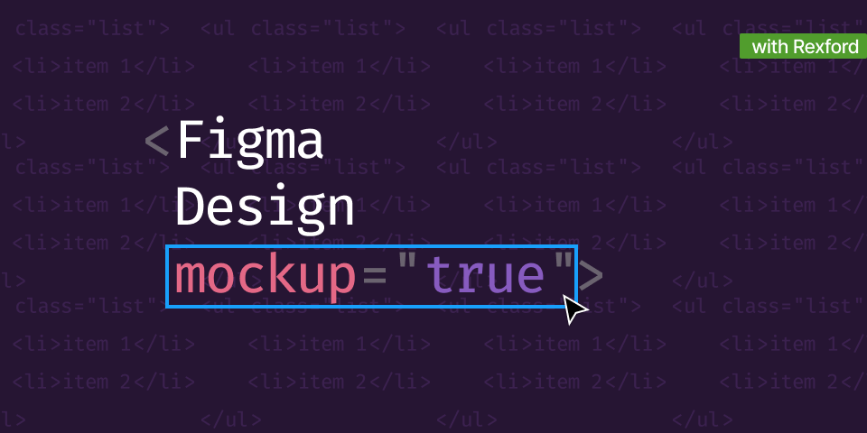

# Pre-Mest Skill Cohort 1
## _Building website mockups with Figma_
> “Whitespace is like air: it is necessary for design to breathe.” –Wojciech Zieliński

## Table of Contents
- [Pre-Mest Skill Cohort 1](#pre-mest-skill-cohort-1)
  - [_Building website mockups with Figma_](#building-website-mockups-with-figma)
  - [Table of Contents](#table-of-contents)
  - [Design Resources](#design-resources)
  - [Figma Tutorials](#figma-tutorials)

Figma is a web-based graphics editing and user interface design app. You can use it to do all kinds of graphic design work from wireframing websites, designing mobile app interfaces, prototyping designs, crafting social media posts, and everything in between.

## Design Resources
- https://github.com/Rexfordasamoah51/Design-Inspiration
- https://icons8.com/animated-icons
- https://icons8.com/illustrations/people

## Figma Tutorials 
- https://www.figma.com/resources/learn-design/design-brief/
- https://www.headway.io/event-series/figma-tutorials-for-beginners